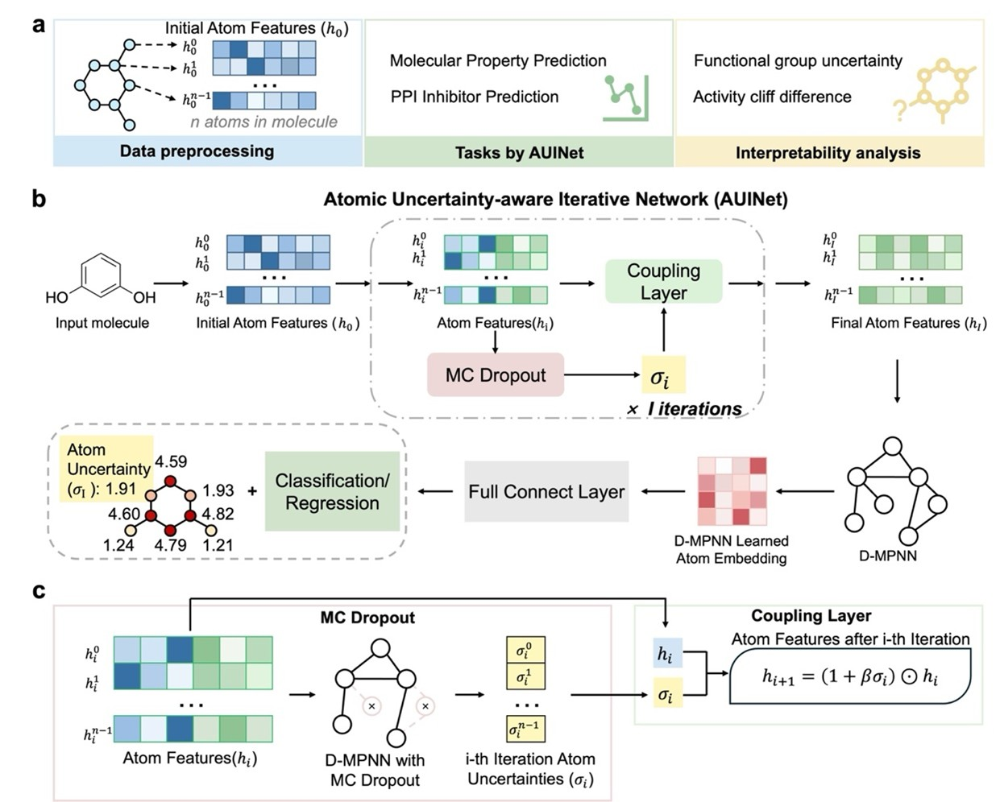

# Interpretable Atomic Uncertainty-aware Iterative Network for Efficient Molecular Property Prediction

# Background
In this study, we introduce AUINet, an Atomic Uncertainty-aware Iterative Network that quantifies and refines uncertainty at the atomic scale. An overview of the proposed model is shown in following figure:  

Built on a D-MPNN architecture, AUINet uses Monte Carlo dropout to estimate atom-level uncertainty and iteratively refines atomic features through uncertainty-guided updating. Comprehensive evaluations show that AUINet outperforms state-of-the-art (SOTA) models on molecular property benchmarks and protein-protein interaction (PPI) inhibitors tasks under low-data conditions, all without requiring extensive pretraining. More importantly, AUINet provides chemically interpretable insights by pinpointing specific functional groups and structural motifs that contribute most to prediction uncertainty, as validated in solubility prediction and activity cliff analysis. Overall, AUINet's precise localization of atomic-level uncertainty establishes a new paradigm for trustworthy molecular property prediction. 

# Installation guide
## Prerequisites

* OS support: Windows, Linux
* Python version: 3.9
* Cuda support: 12.1

## Dependencies

| name         | version |
|   ------------   |   ----   |
|      pandas      | \==2.2.1 |
|     torch_geometric     | \==2.5.2 |
| pytorch | \==2.2.2 |
|       torch_cluster       | \==1.6.3 |
| torch_scatter | ==2.1.2 |
| torch_sparse | ==0.6.18 |
|    rdkit-pypi    | \==2023.9.5 |
|     sklearn      | \==1.4.1 |
|      tqdm        | \==4.66.2 |
|    matplotlib    | \==3.8.4 |

First, note that the requirements.txt file does not contain the command to install pytorch and cuda, you need to run the following command to install it separately:

    $ pip install torch==2.2.2 torchvision==0.17.2 torchaudio==2.2.2 --index-url https://download.pytorch.org/whl/cu121
    
Then, please use the following environment installation command:

    $ pip install -r requirements.txt

# Usage

To train and test a model with an existing dataset:

    $ python main.py

## Result

| Method       |   BACE   |   BBBP   | ClinTox  |  SIDER   |  Tox21   |   HIV    |
| :----------- | :------: | :------: | :------: | :------: | :------: | :------: |
| BACE         |   80.9   |   71.0   |   90.6   |   57.0   |   75.9   |   77.1   |
| MGCN         |   73.4   |   85.0   |   63.4   |   55.2   |   70.7   |   73.8   |
| Attentive FP |   78.4   |   64.3   |   84.7   |   60.6   |   76.1   |   75.7   |
| MOL-AE       |   84.1   |   72.0   |   87.8   |   67.0   | ***80.0*** |   80.6   |
| PretrainGNN  |   84.5   |   68.7   |   72.6   |   62.7   |   78.1   |   81.3   |
| GraphMVP     |   81.2   |   72.4   |   79.1   |   63.9   |   75.9   |   77.0   |
| SCAGE        |   85.4   |   73.4   |   92.7   |   66.0   |   79.4   |    -     |
| Uni-Mol      |   85.7   |   72.9   |   91.9   |   65.9   |   79.6   |   80.8   |
| GEM          |   85.6   |   72.4   |   90.1   |   67.2   |   78.1   |   80.6   |
| **AUINet**   | **87.1** | ***95.9*** | ***95.7*** | ***67.8*** |   78.6   | ***84.1*** |

## Citation
